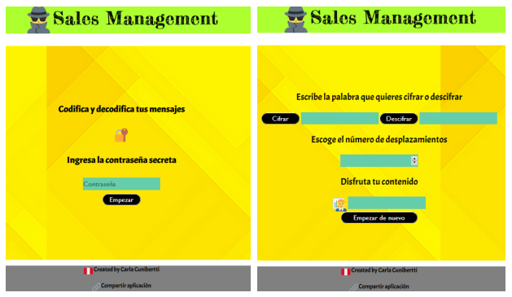
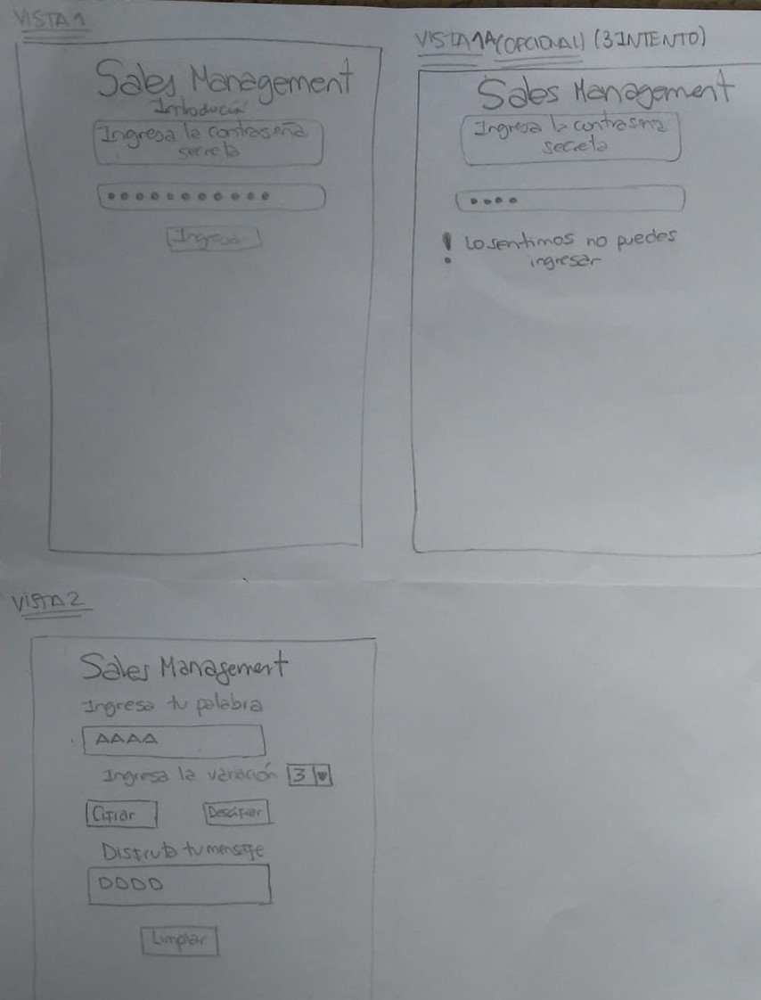
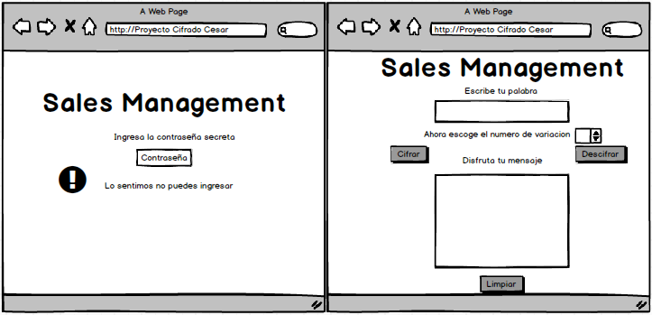
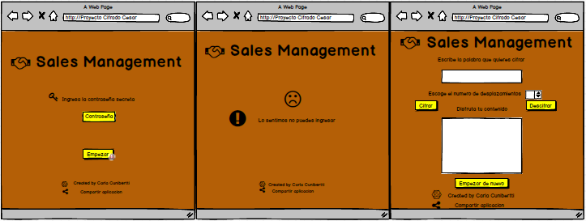

# Sales Management
Es una aplicación que permite cifrar y descifrar mensajes con un número de desplazamientos a elegir.

## Investigación UX

El usuario es un vendedor de un producto o servicio y/o jefe de ventas.

Los objetivos se basan en:

-	Establecer comunicación para negociación de ventas y temas corporativos.

-	Seguridad de las comunicaciones 

-	Privacidad de mensajes por medio del cifrado.

-	Selección de integrantes.

Sales Management soluciona estas necesidades haciendo posible la comunicación entre vendedores y/o jefes del área de ventas o comercial.
Siendo temas posibles las tarifas confidenciales, descuentos para colaboradores que tengan mayores ventas, cambios en la negociación de una venta, entre otros.

Este aplicativo tiene seguridad para los usuarios, ya que valida la clave de acceso a los usuarios.
Es privado, ya que cuenta con un sistema de cifrado con variaciones a elegir.

Además se puede escoger a los integrantes por medio de la validación de la contraseña.

## Primer prototipo en papel y lápiz

 
## Feedback

A partir del prototipo en papel y lápiz inicié con el feedback con las compañeras de mi squad y entrevistas a usuarios.
En la interacción con mis compañeras, en la vista 1, sugirieron la colocación de un botón que sirva para pasar al inicio del juego ("Empezar") lo cual lo había considerado como "Ingresar", además la eliminación de la introducción, debido a que no era necesaria tener una definición en la misma aplicación en sí. 

En la vista primera A-opcional, sugirieron poner el aviso de contraseña errada y el ingreso no permitido  con letras mas pequeñas que el texto central,eliminar la indicación de ingresar la contraseña en el campo para la contraseña ya que era repetitivo en lugar de ello solo poner "contraseña".

En la segunda vista, coincidieron con el aspecto de la vista era bueno ya que integraba todo en una sola vista, a excepción del texto “Ingresa la variación” ya que pensamos que no es entendible y es uno de los aspectos en el que tendría que colocar una palabra más idónea. 

## Entrevista con usuarios

-	Entrevista primer usuario

Carmen tiene 27 años, estudió administración, trabaja actualmente como administradora de proyectos y anteriormente como coordinadora de RR.HH, ella me indicó que la aplicación era entendible y que pusiera imágenes con respecto al tema y colores, que era útil para conversaciones particulares o comunicación entre un área específica de la empresa.

-	Entrevista segundo usuario

Claudia tiene 30 años, estudió hotelería y turismo, trabaja actualmente en un hotel como administradora, ella sugirió respecto a la vista dos que en vez de "Limpiar" colocar “Empezar de nuevo” ya que sería más entendible para los usuarios.
También consideró que sea las vistas tengan colores, resaltó que es muy útil estos mensajes cifrados para tener privacidad y seguridad entre sus usuarios de cualquier hackeo, protegiendo temas personales y corporativos incluso hay aplicaciones de este tipo en el mercado, además consideró que debía ser para público de 18 a 35 años de edad ya que por ser privados debe ser para mayores de 18 por el contenido que se pueda compartir y hasta 35 porque tienen conocimiento de la tecnología, le darían uso responsable y lo entenderían mejor.

## Prototipo final en Balsamiq

Luego del feedback y entrevista con usuarios consideré cambiar algunos aspectos a partir de las sugerencias recibidas, para entregare al usuario una aplicación que resuelva sus necesidades de forma efectiva.
Entre los cambios consideré agregar en  el footer  mi nombre como creadora de la aplicación y un enlace para compartir la aplicación también iconos,  agregarle colores, el color elegido fue el amarillo ya que este color es el más brillante y energetizante de la mayoría de los colores cálidos, es alegre, refleja la diversión y el entendimiento.

Planning
https://onedrive.live.com/edit.aspx?cid=55705385a0687835&page=view&resid=55705385A0687835!400&parId=55705385A0687835!395&app=Word
  

 
